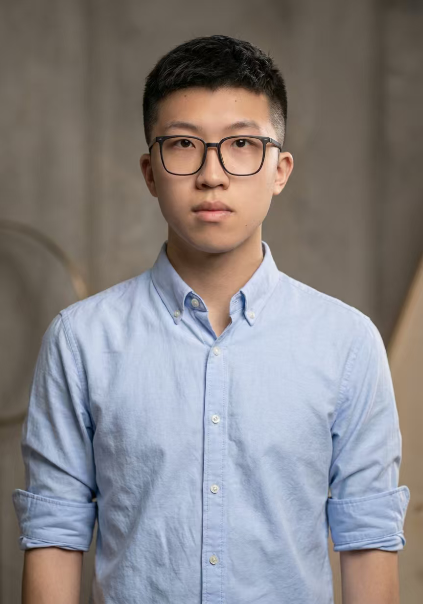

<!-- 学术型 GitHub README 模板 -->

<h1 align="center">Hi 👋, I'm Zixuan Jiang (Andrew)</h1>
<h3 align="center">🎓 Try, Train, Transfer, Transcend</h3>

<!-- 个人照片 -->

  

---

### 🔍 About Me
- 🎓 Currently: **[Undergraduate, College of AI, Xi'an Jiaotong University]**
- 🧑‍💻 Research Interests: **[Multimodal LLM, Speech Interaction, Computer Vision]**
- 🌐 Academic Homepage: [https://anxmuy.github.io/](https://anxmuy.github.io/)
- 📫 Contact: **andrewjiang@stu.xjtu.edu.cn, jiang2213212344@gmail.com**

⭐️ From [AnXMuy](https://github.com/AnXMuy)
