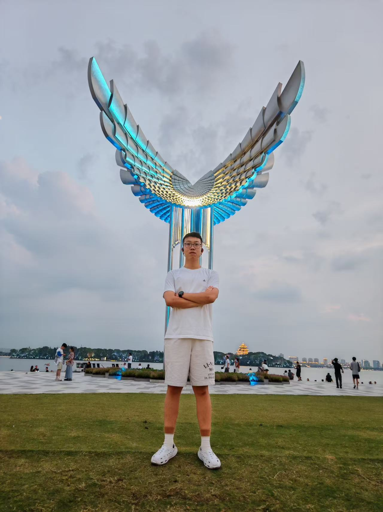

<!-- 学术型 GitHub README 模板 -->

<h1 align="center">Hi 👋, I'm Zixuan Jiang</h1>
<h3 align="center">🎓 Researcher | Student | Lifelong Learner</h3>

<!-- 个人照片 -->

  

---

### 🔍 About Me
- 🎓 Currently: **[B.S. College of AI, Xi'an Jiaotong University]**
- 🧑‍💻 Research Interests: **[Computer Vision, Multimodal Learning, Remote Sensing Image Processing]**
- 🌐 Academic Homepage: [https://anxmuy.github.io/](https://anxmuy.github.io/)
- 📫 Contact: **andrewjiang@stu.xjtu.edu.cn**

---

  

---

### 📊 GitHub Stats

  
  

---

⭐️ From [YourName](https://github.com/AnXMuy)
